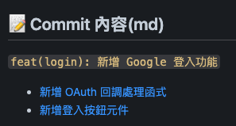

# 📝 Common Standard Commit (zh-TW)

> 一個以 **Angular Commit Message Guidelines** 為基礎的 Claude Code Skill，commit 訊息全程以**繁體中文**撰寫，並在提交後輸出可點擊的互動式結果。

本 Skill 的 commit 格式規範源自 [Angular 官方 Commit Message Guidelines](https://github.com/angular/angular/blob/main/contributing-docs/commit-message-guidelines.md)，也是業界廣泛採用的 Conventional Commits 標準前身。

---

## ✨ 功能特色

- **🔍 自動分析變更** — 智慧判斷檔案差異，決定單一或多個 commit 策略
- **🇹🇼 繁體中文訊息** — commit 描述、Body、Footer 全程中文撰寫（必要時使用英文）
- **📐 Angular 規範格式** — 遵循 [Angular Commit Message Guidelines](https://github.com/angular/angular/blob/main/contributing-docs/commit-message-guidelines.md)，type / scope / 描述清晰分層
- **🔗 可點擊的 commit 結果** — 提交後輸出每筆變更的 markdown 連結，直接跳轉至對應行號，方便查找

---

## 🚀 安裝

### 方法一：直接複製 SKILL.md

```bash
cp SKILL.md ~/.claude/skills/commit.md
```

### 方法二：Clone 整個 Repo

```bash
git clone https://github.com/<your-username>/Common-Standard-Commit-zh-TW.git
cp "Common-Standard-Commit-zh-TW/SKILL.md" ~/.claude/skills/commit.md
```

安裝完成後，在 Claude Code 輸入 `/commit` 即可使用。

---

## 📖 使用方式

在任何 git 專案中，有未提交的變更時，在 Claude Code 中輸入即會自動分析及提交：

```
/commit
```

### Skill 執行流程

```
1. 分析變更   →   git status / git diff
2. 規劃策略   →   判斷單一 or 多個 commit
3. 暫存檔案   →   git add <file>（逐一加入）
4. 撰寫訊息   →   Conventional Commits 格式 + 繁體中文
5. 執行提交   →   git commit（HEREDOC 格式）
6. 呈現結果   →   可點擊的互動式 commit 摘要
```

---

## 📐 Commit 訊息格式

> 格式規範參照 [Angular Commit Message Guidelines](https://github.com/angular/angular/blob/main/contributing-docs/commit-message-guidelines.md)

```
<type>(<scope>): <簡短描述>

<Body：詳細說明（可選）>

<Footer（可選）>
```

### Type 類型對照表

| Type       | 用途                     |
| ---------- | ------------------------ |
| `feat`     | ✨ 新增功能               |
| `fix`      | 🐛 修復錯誤               |
| `refactor` | ♻️ 重構（不改變功能）     |
| `docs`     | 📝 文件變更               |
| `style`    | 🎨 格式調整（不影響邏輯） |
| `test`     | 🧪 測試相關               |
| `chore`    | 🔧 雜務（建置、設定等）   |
| `perf`     | ⚡ 改善效能               |
| `revert`   | ⏪ 撤銷先前的 commit      |

### 範例

```
feat(auth): 新增第三方登入功能

整合 Google OAuth2.0 登入流程。
調整項目：
1. auth.js：新增 OAuth 回調處理邏輯
2. login.vue：新增 Google 登入按鈕元件

issue #42
```

---

## 🔗 互動式 Commit 結果

提交成功後，Skill 會輸出如下md格式，每條變更皆為可點擊連結：

### markdown格式範例

```markdown
## 📝 Commit 內容

`feat(login): 新增 Google 登入功能`

- [新增 OAuth 回調處理函式](src/auth.js#L12-L35)
- [新增登入按鈕元件](src/components/LoginButton.vue#L1-L28)
```

### 圖片範例



點擊連結可直接在 IDE 中跳轉至對應程式碼位置。

---

## ⚙️ 規則與限制

- 描述不超過 **50 個字元**
- Body 每行不超過 **72 個字元**
- 不使用 `git add -A` 或 `git add .`
- 不提交敏感檔案（`.env`、credentials 等）
- 行號依據 `git show` 實際輸出，不自行推測

---

## 📋 需求

- [Claude Code CLI](https://code.claude.com/docs/en/overview)
- Git

---

## 📜 授權

MIT — 自由使用、修改、分享。
